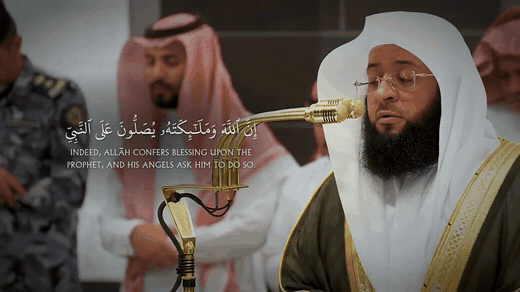
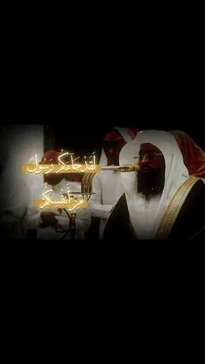
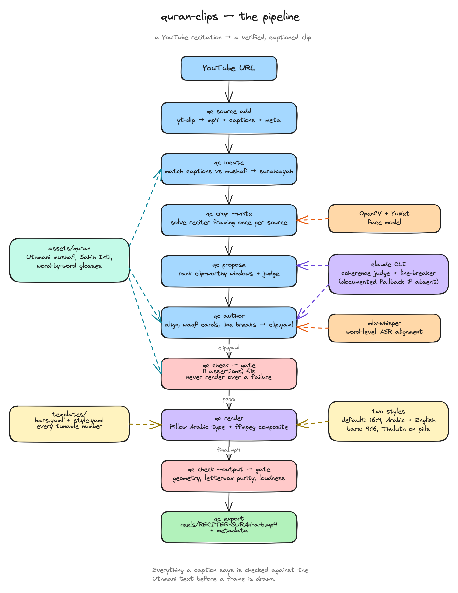

# quran-clips

A command-line pipeline that turns a YouTube recitation into a captioned clip:
find the ayat, cut the window at real pauses, align the words against the mushaf,
render Arabic type with Pillow, composite in ffmpeg.

Everything a caption says is checked against the Uthmani text before a frame is
drawn. Nothing is typed by hand into a video editor.

## Two styles

<table>
<tr>
<td width="50%" valign="top">

**`default`** — 1920×1080 landscape, Arabic + English

[](https://github.com/y-u-s-u-f/quran-clips/blob/main/docs/demo-default-badr-al-turki-ahzab-56.mp4)

Badr al-Turki, al-Aḥzāb 33:56 · [full clip, with sound ▶](https://github.com/y-u-s-u-f/quran-clips/blob/main/docs/demo-default-badr-al-turki-ahzab-56.mp4) · recipe: [`clips/al-ahzab-56-56/clip.yaml`](clips/al-ahzab-56-56/clip.yaml)

</td>
<td width="50%" valign="top">

**`bars`** — 1080×1920 vertical, Arabic-only on coloured pills

[](https://github.com/y-u-s-u-f/quran-clips/blob/main/docs/demo-bars-badr-al-turki-tawbah-128.mp4)

Badr al-Turki, at-Tawbah 9:128 · [full clip, with sound ▶](https://github.com/y-u-s-u-f/quran-clips/blob/main/docs/demo-bars-badr-al-turki-tawbah-128.mp4) · recipe: [`clips/at-tawbah-128-128/clip.yaml`](clips/at-tawbah-128-128/clip.yaml)

</td>
</tr>
</table>

The previews are silent GIFs — click either one to open the clip with sound in
GitHub's player. Both
demos are re-encoded down for the browser; the pipeline's own output is
full-resolution H.264. The style is fixed per clip by the `style:` key in
`clip.yaml`, and it keys the cached crop too — pass the same `--style` to every
command in a run.

`bars` letterboxes the footage into a centred 16:9 band with pure-black bars,
grades it down to the reference's luma, and lays Thuluth captions on equal-width
pills. `default` keeps the landscape frame and carries an English line from the
Sahih International text. Parameters live in `templates/bars.yaml` and
`templates/style.yaml`; both were derived from pixel measurements of reference
reels, written up in `style/refs2/STYLE2_SPEC.md` and `style/STYLE_SPEC.md`.

## The pipeline



The editable source is [`docs/pipeline.excalidraw`](docs/pipeline.excalidraw) —
drop it onto [excalidraw.com](https://excalidraw.com).

```
qc source add <url>      yt-dlp -> sources/<id>.mp4 + auto-captions + meta yaml
qc locate <id>           match the captions against the mushaf -> surah + ayat
qc crop <id> --write     solve the reciter/caption framing once per source
qc propose <id>          rank clip-worthy windows; a model judges whether each
                         one stands alone or opens on a dangling referent
qc author <id> 9:128 <start> <end> -o clips/<name>
                         align to the mushaf, measure the RMS envelope, split
                         the cards at real waqf gaps, break the lines,
                         fill the English -> clip.yaml
qc check clips/<name>    ~1s of assertions. Never render over a failure
qc render clips/<name>   -> clips/<name>/output/final.mp4
qc check --output ...    decodes the result: geometry, letterbox purity,
                         loudness, and that the bitstream is not corrupt
qc doctor                resolved tools, ASR backend, egress plan
qc export clips/<name>   -> reels/RECITER-SURAH-a-b.mp4 with metadata
```

`./bin/qc` with no arguments prints the authoritative usage.

### What `check` enforces

The reason this is a pipeline and not an editing session. Eleven assertions,
under a second, no ffmpeg:

1. **Arabic == mushaf.** Waqf signs and U+0640 tatweel are stripped, then the
   caption must match the Uthmani text exactly.
2. **Schema.** An unknown key is an error — the renderer would silently ignore a
   typo'd one.
3. **Glyph coverage.** Every codepoint exists in the font that will draw it.
4. **The clip opens on the first word of the ayah it claims**, and no card spans
   two ayat.
5. Phrase/cut ordering, caption geometry, no hard-cut changeover, English
   present-or-absent per style, known fx names.

`check --output` additionally DECODES the finished file. Container metadata
survives a corrupted bitstream -- a file whose payload was interleaved by a second
writer still reports the right geometry and duration -- so a decode pass plus a
decoded-frame count is the only thing that catches it.

## Running it

macOS or Linux. Every external tool is resolved per machine (`$QC_*`, then
`qc.toml`, then PATH, then a platform hint), so there are no absolute paths baked
into the code. **Run `./bin/qc doctor` after setup**: it prints what resolved,
which ASR backend this host selects, the egress plan, and what any missing piece
would block.

`./bin/qc` and `./bin/quran-clips` are the same CLI under two names.

```sh
# macOS
brew install ffmpeg yt-dlp python@3.14
# Debian/Ubuntu
sudo apt install ffmpeg yt-dlp python3-venv

# The venvs below are only needed when your CURRENT interpreter cannot already
# import what a stage wants. Run `./bin/qc doctor` first -- it reports what each
# stage resolves to, and an environment that already works is never rebuilt.
#
# Pillow must have RAQM for Arabic shaping, which is why render uses
# --system-site-packages over a python whose Pillow already has it.
python3.14 -m venv --system-site-packages tools/render-venv
tools/render-venv/bin/pip install -r requirements/render.txt

# authoring: the crop solver (OpenCV + the YuNet face model)
python3.14 -m venv tools/author-venv
tools/author-venv/bin/pip install -r requirements/author.txt
mkdir -p tools/models && curl -sSL -o tools/models/face_detection_yunet_2023mar.onnx \
  https://media.githubusercontent.com/media/opencv/opencv_zoo/main/models/face_detection_yunet/face_detection_yunet_2023mar.onnx

# word-level ASR, kept out of the render interpreter so whisper can never
# replace its RAQM Pillow. mlx-whisper on Apple silicon; faster-whisper elsewhere.
python3.14 -m venv tools/asr-venv
tools/asr-venv/bin/pip install mlx-whisper        # Apple silicon
# tools/asr-venv/bin/pip install faster-whisper   # Linux / Intel
```

Machine-level settings live in `.env` (gitignored; see `.env.example`): tool
paths, the ASR backend and model, and the proxy pool. All optional -- with ffmpeg
on PATH nothing needs configuring. Nothing in `.env` affects a rendered pixel;
style geometry stays in the committed `templates/*.yaml`.

On a cloud host YouTube bot-checks the datacentre IP, so `qc source add` can route
through a proxy pool and escalates **static residential -> datacentre -> fail**:

```sh
QC_PROXY_STATIC=user:pass@host:port,...        # five static residential exits
QC_PROXY_DATACENTER=user:pass@host:port,...    # fallback tier
```

A signed googlevideo URL embeds the exit IP that resolved it, so only sticky exits
can download and the pool is pinned per video id. Credentials are redacted in
every log line.

Then:

```sh
./bin/qc source add "https://www.youtube.com/watch?v=..."
./bin/qc locate <video_id>
./bin/qc crop <video_id> --style bars --write
./bin/qc propose <video_id> --style bars
./bin/qc author <video_id> 9:128 15:27 15:57 --style bars -o clips/my-clip
./bin/qc check clips/my-clip && ./bin/qc render clips/my-clip
```

A 24-second `bars` render takes about six minutes. `render --preview` writes a
half-size, effects-free version for judging timing and layout — never the look.

The `propose` coherence judge and the caption line-breaker shell out to the
`claude` CLI (`QC_CLAUDE_BIN` to point elsewhere, `--no-judge` to skip). Both
degrade to a documented fallback when it is absent; the report says which path
it took.

## Layout

```
qc/            the package: author/ (fetch, locate, crop, propose, align,
               linebreak, emit), render.py, ffgraph.py, check.py, fx/
scripts/       render_bars.py, render_text.py, export_reel.py, status.py,
               golden.py — invoked with tools/render-venv/bin/python
templates/     bars.yaml, style.yaml — every tunable number
assets/        fonts (Thuluth, Uthmanic Hafs), the Uthmani mushaf, Sahih
               International, word-by-word glosses, reciter scene plates
style/         the pixel-forensics specs the templates were derived from
tests/         fx scalar pins + golden fixtures (argv, filtergraph, md5)
clips/         five example clip.yaml recipes (see below)
```

### Tests

```sh
tools/render-venv/bin/python -m unittest discover -s tests
tools/render-venv/bin/python scripts/golden.py check --all      # env + argv + filtergraph
tools/render-venv/bin/python scripts/golden.py check --full <clip>   # + render md5
```

The media md5s are valid only for the exact ffmpeg build recorded in
`tests/golden/ENV.txt`. A different ffmpeg produces a different file from a
byte-identical filtergraph, so on an upgrade the argv/filtergraph tiers stay
meaningful and the media tiers must be re-blessed against a visual review.
The golden tiers need the original source videos, which are not in the repo.

## What is not in the repo

The clip library is my own output, not code, so it stays local: `clips/`,
`reels/`, the downloaded footage under `sources/`, and the venvs under `tools/`.
Five `clip.yaml` recipes ship as examples — the two above, plus the three other
golden-fixture inputs. Everything needed to build your own is here.

Two vendored text editions sit under `assets/quran/`: the Uthmani mushaf and the
Sahih International translation, plus word-by-word glosses. The fonts are
Thuluth and Uthmanic Hafs.

Nothing here downloads or redistributes anyone's footage — the pipeline points
`yt-dlp` at a URL you choose, and what you may do with the result is between you
and whoever recorded it.
