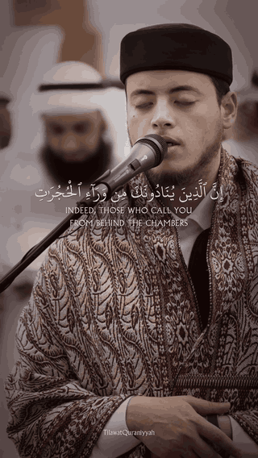
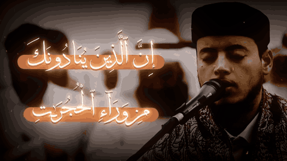

# quran-clips

Turn a Qur'an recitation video into a subtitled reel. The Arabic is sliced
from the committed Uthmani mushaf by word index — never typed or transcribed —
and forced alignment times each known word onto the audio.

| `vertical` | `horizontal` | `bars` |
|---|---|---|
| [](docs/demo-vertical.mp4) | [](docs/demo-horizontal.mp4) | [](docs/demo-bars.mp4) |
| 1080×1920, Arabic + English under the reciter's chin | 1920×1080, the same look in the column opposite him | 1920×1080, Thuluth on pills, full FX, Arabic only |

Click a preview for the full-quality clip. `vertical` and `bars` are
Al-Hujurat 49:4-5 (`sources/hajri-23-taraweeh/`); `horizontal` is Al-Ahzab
33:56 (`sources/YkXjYyKwHJ4/`).

## Quickstart

```sh
./install.sh                                          # or ./install.sh --check
python3 pipeline/fetch.py "https://www.youtube.com/watch?v=..."
python3 pipeline/transcribe.py sources/<id>           # find the span; repairs restarts
# write sources/<id>/<reel>.yaml  (verse span, card splits)
tools/align-venv/bin/python  pipeline/align.py    sources/<id>/<reel>.yaml
tools/render-venv/bin/python pipeline/crop.py     sources/<id>/<reel>.yaml --write --annotate /tmp/c.png
tools/render-venv/bin/python pipeline/generate.py sources/<id>/<reel>.yaml
python3 pipeline/publish.py reels/<reel>.mp4          # Instagram + Facebook
```

The config schema: `tools/render-venv/bin/python pipeline/generate.py
--print-schema`. The two example sources' configs are tracked, each with its
`# source:` URL, so any of them re-renders after a fetch.

## Where to read next

- `pipeline/README.md` — the pipeline reference: stages, files, styles.
- `.agents/skills/make-post/SKILL.md` — the step-by-step workflow, config
  rules and fixes.
- `INSTALL.md` — setup and machine config (`.env`).
- `AGENTS.md` — code map and invariants, for changing the code.
- `OPTIMIZATIONS.md` — render cost; `docs/asr-and-alignment.md` — why these
  models; `todo.md` — the open list.

Media and renders stay local; only configs are committed. Nothing here
redistributes anyone's footage beyond the short demo clips above.
